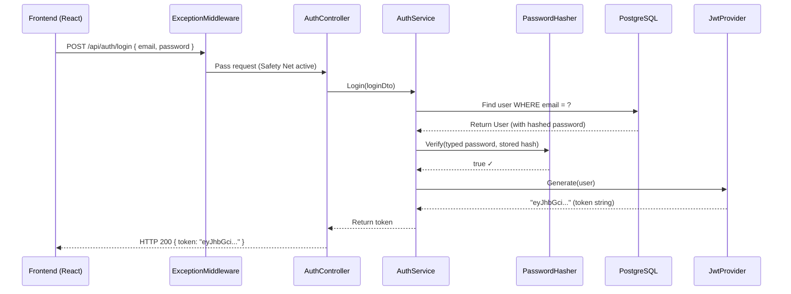
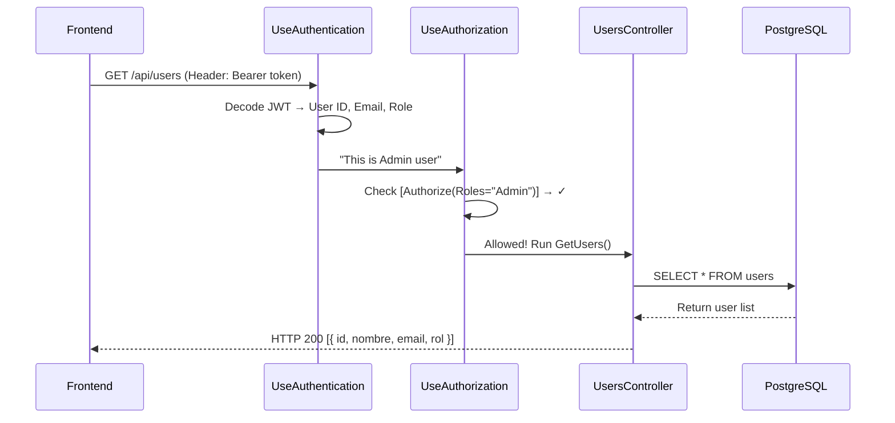

# How the Backend Works: Complete Architecture Overview

This document explains the entire project — every folder, every file, and how they all connect together.

---

## 1. Project Structure (The Map)

```
api/
├── Program.cs              ← The "Main Switch" (Starts everything)
├── appsettings.json        ← The "Settings File" (Passwords, DB URL, JWT Keys)
│
├── Domain/
│   └── User.cs             ← The "Blueprint" of a User (ID, Name, Email, Password, Role)
│
├── Dtos/
│   └── AuthDtos.cs         ← The "Input Forms" (LoginDto, RegisterDto)
│
├── Data/
│   ├── AppDbContext.cs     ← The "Bridge" between C# and PostgreSQL
│   └── DbInitializer.cs   ← The "First-Time Setup" (Seeds initial data)
│
├── Common/
│   └── PasswordHasher.cs  ← The "Shredder" (Encrypts passwords with BCrypt)
│
├── Security/
│   └── JwtProvider.cs     ← The "ID Card Maker" (Creates JWT Tokens)
│
├── Services/
│   └── AuthService.cs     ← The "Brain" (Login/Register logic)
│
├── Controllers/
│   ├── AuthController.cs  ← The "Receptionist" for login/signup
│   ├── UsersController.cs ← The "Admin Panel" (List users, Admin only)
│   └── HealthController.cs← The "Heartbeat" (Is the server alive?)
│
└── Middleware/
    └── ExceptionMiddleware.cs ← The "Safety Net" (Catches all crashes)
```

---

## 2. What Each File Does

### Layer 1: Domain (`Domain/User.cs`)
The **core entity**. This class defines what a "User" looks like in the database:

| Property | Type | Database Column | Description |
| :--- | :--- | :--- | :--- |
| `Id` | int | `id` | Primary Key (auto-generated) |
| `Nombre` | string | `nombre` | User's name |
| `Email` | string | `email` | Must be unique |
| `Password` | string | `password` | Stored as a BCrypt hash |
| `Rol` | string | `rol` | "Admin" or "User" |

---

### Layer 2: DTOs (`Dtos/AuthDtos.cs`)
"Data Transfer Objects" — simple containers that define **what the frontend sends**:

- **`LoginDto`**: `{ Email, Password }` — What the user types to log in.
- **`RegisterDto`**: `{ Nombre, Email, Password, Rol }` — What the user types to sign up.

> [!TIP]
> DTOs protect your system. The frontend never touches the real `User` object directly.

---

### Layer 3: Data (`Data/`)
- **`AppDbContext.cs`**: Inherits from `DbContext` (Microsoft's database tool). It:
  - Connects to PostgreSQL using the connection string from `appsettings.json`.
  - Maps `User.cs` → `users` table via `DbSet<User> Users`.
  - Enforces unique emails via `HasIndex(u => u.Email).IsUnique()`.

- **`DbInitializer.cs`**: Runs once at startup. Seeds the database with default users (e.g., an Admin account).

---

### Layer 4: Security (`Common/` + `Security/`)
- **`PasswordHasher.cs`** (Common):
  - `Hash(password)` → Turns "mypassword123" into "$2a$11$xyz..." (unreadable).
  - `Verify(password, hash)` → Checks if the typed password matches the stored hash.
  - Uses the **BCrypt** NuGet package.

- **`JwtProvider.cs`** (Security):
  - `Generate(user)` → Creates a JWT Token containing the user's **ID**, **Email**, and **Role**.
  - The token is signed with a secret key from `appsettings.json` and expires in **60 minutes**.

---

### Layer 5: Services (`Services/AuthService.cs`)
The **brain** of the application. It connects all the tools together:

- **`Login(LoginDto)`**:
  1. Searches the database for the user by email.
  2. Verifies the password using `PasswordHasher`.
  3. If valid, generates a JWT Token using `JwtProvider`.
  4. Returns the token string.

- **`Register(RegisterDto)`**:
  1. Checks if the email already exists.
  2. Hashes the password.
  3. Creates a new `User` object and saves it to the database.

---

### Layer 6: Controllers (`Controllers/`)

- **`AuthController.cs`** — Public (no login required):
  - `POST /api/auth/login` → Calls `AuthService.Login()`, returns `{ token: "..." }`.
  - `POST /api/auth/signup` → Calls `AuthService.Register()`, returns `{ message, userId }`.

- **`UsersController.cs`** — Protected (`[Authorize(Roles = "Admin")]`):
  - `GET /api/users` → Returns a list of all users (ID, Name, Email, Role).
  - Only accessible with a valid JWT Token that has the "Admin" role.

---

### Layer 7: Middleware (`Middleware/ExceptionMiddleware.cs`)
A global **try-catch** that wraps every single request:
- If anything crashes → catches the error.
- In **Development** → shows full error details (message + stack trace).
- In **Production** → shows generic "Internal Server Error".

---

## 3. The Complete Request Flow

### Login Flow (Step by Step)



### Protected Request Flow (e.g., GET /api/users)



---

## 4. How `Program.cs` Connects Everything

`Program.cs` is split into two phases:

### Phase 1: Registration (builder.Services)
Registering all the tools so the app knows they exist:

| Line | What it registers |
| :--- | :--- |
| `AddDbContext<AppDbContext>` | Database connection |
| `AddScoped<IPasswordHasher, PasswordHasher>` | Password encryption tool |
| `AddScoped<IJwtProvider, JwtProvider>` | Token generator |
| `AddScoped<IAuthService, AuthService>` | Login/Register logic |
| `AddAuthentication(...)` | JWT token validation rules |
| `AddAuthorization()` | Permission checking system |
| `AddCors(...)` | Frontend access rules |
| `AddControllers()` | API endpoint discovery |

### Phase 2: Middleware Pipeline (app.Use...)
The order requests pass through:

```
Request arrives
    → ExceptionMiddleware (Safety Net)
    → HTTPS Redirect (Force encryption)
    → CORS Check (Is this website allowed?)
    → Authentication (Who are you?)
    → Authorization (Are you allowed here?)
    → Controller (Run the actual code)
Response sent back
```

> [!IMPORTANT]
> The order of middleware matters! Authentication must come before Authorization, because you need to know WHO someone is before checking WHAT they can do.
